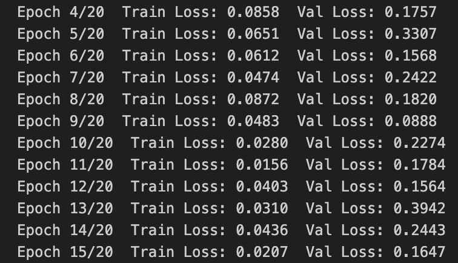
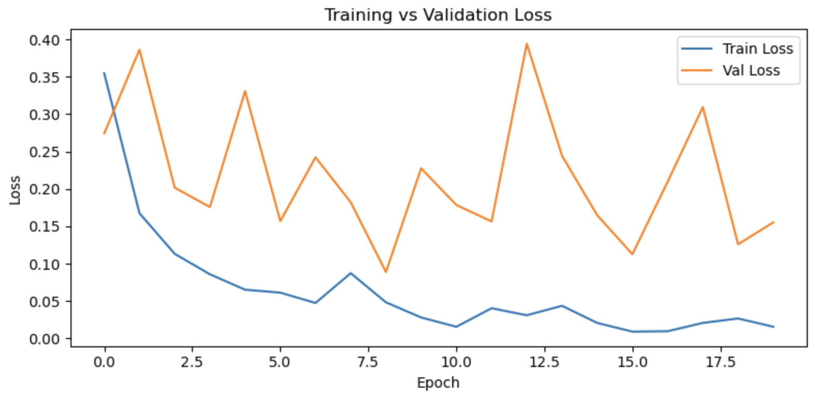
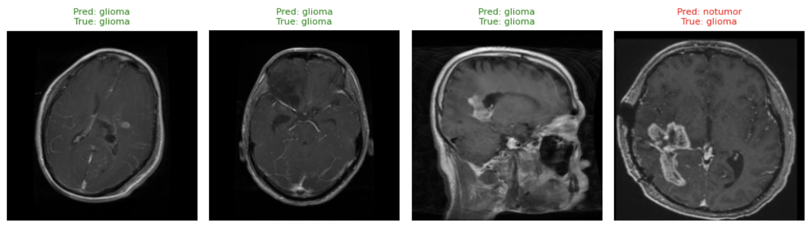

# 🧠 Brain Tumor MRI Classification

A deep learning project that classifies brain MRI scans into **Glioma**, **Meningioma**, **Pituitary Tumor**, and **No Tumor** using **PyTorch** and **ResNet-18**.

The project demonstrates a complete computer vision pipeline, including data preprocessing, transfer learning, model training, evaluation, and prediction visualization for multi-class brain tumor classification.

# Features

- Classifies brain MRI scans into four tumor categories.
- Uses **ResNet-18** with transfer learning for improved classification performance.
- Performs image preprocessing and data augmentation.
- Includes model training, validation, and testing pipelines.
- Visualizes model predictions and training performance.
- Built entirely using **PyTorch**.

# How it works

### 1. Load the Dataset
Brain MRI images are loaded and organized into four classes: **Glioma**, **Meningioma**, **Pituitary Tumor**, and **No Tumor**.

### 2. Preprocess Images
Images are resized, normalized, and augmented using **torchvision** transforms to improve model generalization.

### 3. Prepare the Model
A pretrained **ResNet-18** model is loaded, and its final classification layer is modified to predict the four target classes.

### 4. Train the Model
The model is fine-tuned on the training dataset using transfer learning while monitoring training performance across multiple epochs.

### 5. Evaluate Performance
The trained model is evaluated on unseen test images to measure its classification performance.

### 6. Visualize Results
Training metrics and sample predictions are generated to provide insights into the model's learning and prediction capabilities.

# Results

  

  

  

# Tech Stack

| Category | Technologies |
|----------|--------------|
| Programming Language | Python |
| Deep Learning Framework | PyTorch |
| Model | ResNet-18 (Transfer Learning) |
| Image Processing | torchvision, PIL |
| Visualization | Matplotlib |
| Development Environment | Jupyter Notebook |

# Future Improvements

- Implement **Grad-CAM** to visualize regions influencing model predictions.
- Compare performance with modern architectures such as **EfficientNet** and **Vision Transformers (ViTs)**.
- Deploy the model as an interactive web application using **Streamlit** or **Gradio**.
- Add advanced evaluation metrics including Precision, Recall, F1-score, and ROC-AUC.
- Support inference on custom MRI images through a simple prediction interface.
